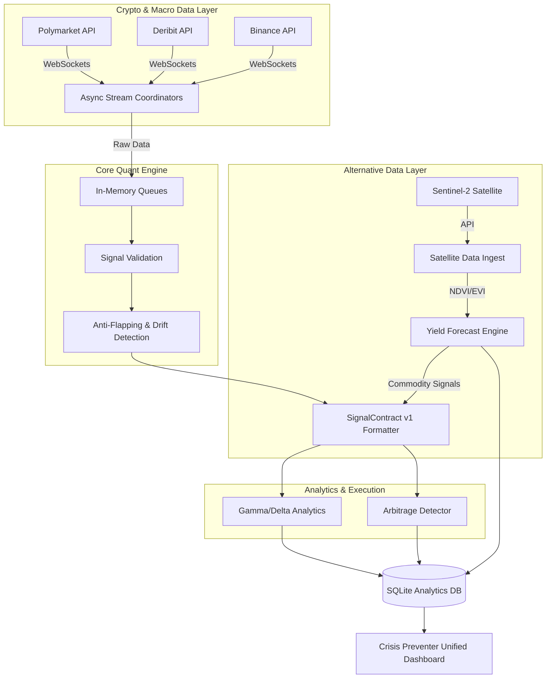

<h1 align="center">
  🌍 Crisis Preventer (OrbitAlpha Quant)
</h1>

<p align="center">
  <strong>Alternative Data & Institutional Arbitrage Engine: Satellite Observations meet Crypto Options</strong>
</p>

<p align="center">
  
  
  
  
</p>

## 📖 Overview

**Crisis Preventer** is an institutional-grade quantitative analysis engine that bridges the physical world of agriculture and the digital world of derivatives trading. 

By ingesting **Alternative Data (AltData)** from Copernicus Sentinel-2 satellites to forecast agricultural yields, the engine correlates physical supply-chain shocks with global macro-economic indicators. Simultaneously, it runs a high-performance asynchronous arbitrage engine, calculating **Gamma Squeeze risk** and **Delta Hedging sensitivities** across prediction markets (Polymarket) and traditional crypto derivatives (Deribit/Binance).

> **Note:** This is a stripped-down "Open Core" version. Proprietary alpha-generating strategies, proprietary execution modules, and live API keys have been removed.

---

## 🛰️ Strategic Satellite Dashboard


*OrbitAlpha UI: High-resolution Sentinel-2 crop health overlays, real-time crypto arbitrage spreads, and Gamma Squeeze monitors.*

---

## ✨ Key Features

*   🛰️ **Satellite Data Ingestion (AltData):** Automated pipelines processing Sentinel-2 L2A satellite data to monitor vegetation indices (NDVI, EVI) and forecast crop yields using LightGBM + Prophet.
*   ⚡ **Real-Time Arbitrage Engine:** Ingests high-frequency data via WebSockets to detect risk-neutral probability spreads and execution opportunities between Polymarket and Binance/Deribit.
*   📊 **Institutional Hedging Analytics:** Calculates critical options market metrics including **Gamma Flip price levels** and **Delta Hedging sensitivity** to anticipate institutional liquidity risks and reflexivity.
*   🛡️ **Robust Signal Architecture:** Built around a strict `SignalContract v1` schema. Features built-in anti-flapping mechanisms, data drift detection, and rigorous data quality gates to prevent false positives in high-volatility environments.
*   📈 **Macro-to-Micro Dashboard:** Streamlit-powered UI that visualizes both satellite-derived commodity forecasts and crypto institutional positioning.

---

## 🏗️ System Architecture



---

## 🚀 Quick Start

```bash
# Clone the repository
git clone https://github.com/TedeuszNorek/Crisis_Preventer.git
cd Crisis_Preventer

# Set up virtual environment
python -m venv venv
source venv/bin/activate

# Install dependencies
pip install -r requirements.txt

# Environment variables (Create .env file)
# Note: Do not commit your .env file
echo "SENTINEL_HUB_CLIENT_ID=your_id" >> .env
echo "SENTINEL_HUB_CLIENT_SECRET=your_secret" >> .env

# Run the core engine (Mock mode)
python -m signalvortex.cli.run_full --mock-feeds

# Run the UI Dashboard
streamlit run app.py
```
