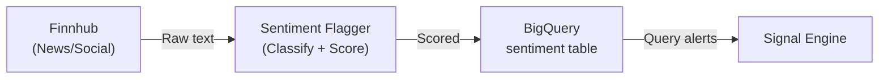

# SignalVortex - Unified System Architecture (24/7 Alpha Engine)

**Goal**: Generate asymmetrically high risk-adjusted returns by fusing alternative data (maritime, satellite) with traditional financial signals (options flow, crypto funding, macro).

**Deployment**: Local GPU server + BigQuery (sentiment storage already active).

---

## 1. Data Source Inventory

| Module | Type | Data | Frequency | Alpha Signal |
|--------|------|------|-----------|--------------|
| **AISStream** | Maritime | Ship positions | Real-time | Commodity bottlenecks, supply chain |
| **AgriSatAnalytics** | Satellite | NDVI, Weather, Imagery | 6h | Crop yields, energy demand, inventory |
| **Polygon** | Equities | Stocks, Options | Real-time | Price, Greeks, Flow |
| **Binance** | Crypto | Futures, OI, Funding | Real-time | Leverage, Sentiment |
| **Coinalyze** | Crypto | OI, Liquidations | 5 min | Crowded trades, squeezes |
| **Finnhub** | Sentiment | News, Social | 15 min | Sentiment spikes → **Flag in BQ** |
| **Gamma** | Options | Dealer positioning | Daily | Gamma exposure, pin risk |
| **FRED** | Macro | Interest rates, CPI | Daily/Weekly | Regime shifts |
| **ECB** | Macro | EUR policy, M3 | Monthly | Liquidity cycles |
| **GetDome** | Order Flow | Depth, Imbalance | Real-time | Short-term momentum |
| **Massive** | Alt-Data | Custom signals | Variable | Proprietary indicators |

### AgriSatAnalytics Integration
- **Source**: ESA Planet Sentinel API + Earth Search STAC
- **Endpoints**:
  - `ndvi_pipeline.py --source earth-search` (no API key needed)
  - Weather API: Open-Meteo + Meteostat fallback
  - Planet quick-search: `ESA_PLANET_API_KEY` required
- **FastAPI**: Token auth (`X-API-KEY`), base64 image input
- **Docker**: GPU-ready (NVIDIA), port 8000
- **Use Cases**:
  - Crop yield prediction (Corn, Wheat futures)
  - Energy demand (solar irradiance, temperature)
  - Retail foot traffic (parking lot analysis via `/analyze`)

---

## 2. Sentiment Flagging Pipeline



### Flagging Logic
1. **Ingest**: Finnhub news/social every 15 min
2. **Classify**:
   - **Bullish/Bearish/Neutral** (FinBERT or rule-based)
   - **Intensity**: 0.0-1.0 (headline impact)
   - **Asset**: Map to ticker (BTC, SPY, CL, etc.)
3. **Flag Conditions** (store in `sentiment_flags` table):
   - `sentiment_spike`: Score change >0.3 in 1h
   - `volume_surge`: News count 3x normal
   - `contradiction`: Bullish news + Bearish price action
4. **BigQuery Table**: `sentiment_flags`
   | Column | Type |
   |--------|------|
   | `flag_time` | TIMESTAMP |
   | `asset` | STRING |
   | `flag_type` | STRING |
   | `sentiment_score` | FLOAT64 |
   | `headline` | STRING |
   | `source` | STRING |

---

## 3. Scheduling Matrix (24/7)

| Module | Frequency | Trigger | Priority |
|--------|-----------|---------|----------|
| **AISStream** | Continuous | WebSocket | P0 |
| **Binance WS** | Continuous | WebSocket | P0 |
| **GetDome** | Continuous | WebSocket | P0 |
| **Coinalyze** | Every 5 min | Scheduler | P1 |
| **Polygon** | Market hours | REST/WS | P1 |
| **Finnhub + Flagging** | Every 15 min | Scheduler | P1 |
| **AgriSat NDVI** | Every 6 hours | Scheduler | P2 |
| **AgriSat Weather** | Every 1 hour | Scheduler | P2 |
| **Gamma** | Daily 16:00 UTC | Scheduler | P2 |
| **FRED/ECB** | Daily 08:00 UTC | Scheduler | P3 |

---

## 4. Alpha Strategies

### 4.1 Commodity (Maritime + Satellite)
- **Signal**: Rotterdam congestion + NDVI drought indicator
- **Trade**: Long Wheat futures

### 4.2 Crypto Squeeze (OI + Funding + Sentiment)
- **Signal**: BTC OI ATH + Funding >0.1% + Bearish sentiment flag
- **Trade**: Short BTC perps (fade crowd)

### 4.3 Energy (Weather + Macro)
- **Signal**: Cold snap forecast (AgriSat Weather) + Low natgas storage
- **Trade**: Long NG futures

### 4.4 Earnings Alpha (Satellite + Sentiment)
- **Signal**: Parking lot traffic -20% + Sentiment spike bullish
- **Trade**: Short stock (reality vs hype disconnect)

---

## 5. Local Deployment Architecture

```
GPU Server (Local)
├── Docker Containers
│   ├── stream-manager (AISStream + Binance WS) [always-on]
│   ├── agrisat-gpu (AgriSatAnalytics FastAPI) [port 8000]
│   ├── scheduler (APScheduler Python) [cron jobs]
│   └── sentiment-flagger (Finnhub → BQ) [every 15min]
├── SQLite Cache (weather/cache.db)
└── GCS/BQ Sync (periodic upload)

BigQuery (GCP)
├── positions
├── sentiment
├── sentiment_flags
├── signals
└── ...
```
